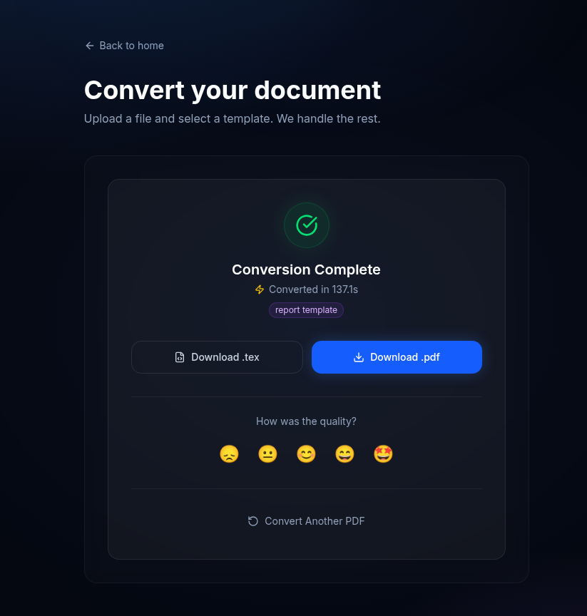
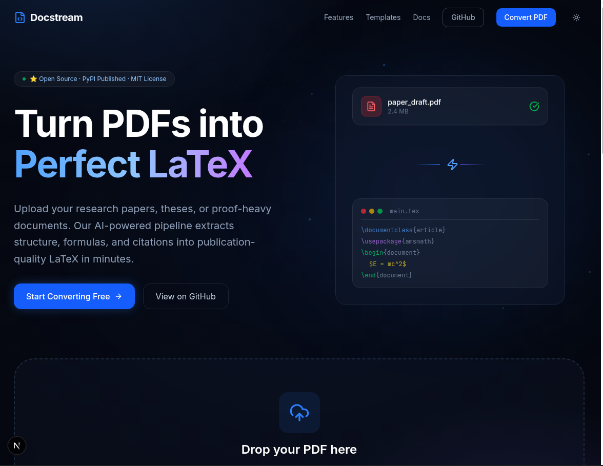
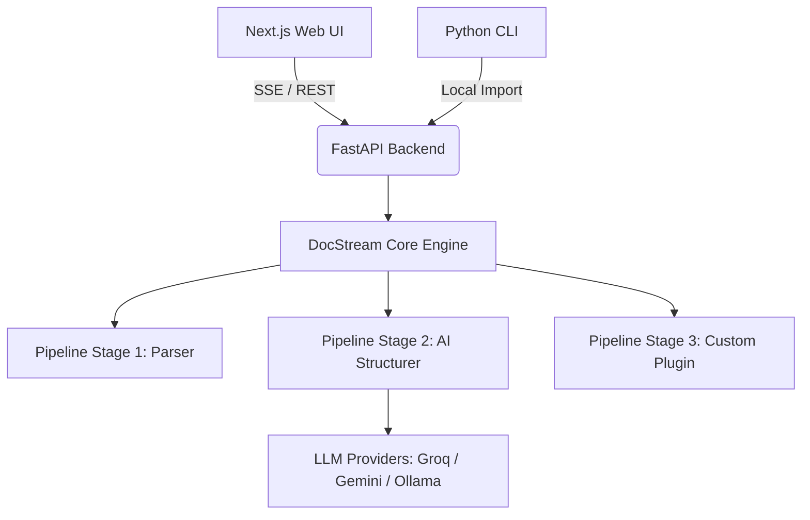

# 📄 DocStream

> High-performance, AI-powered document processing engine with real-time streaming and a modular plugin architecture.

[](https://github.com/YashKasare21/docstream-new/actions/workflows/ci.yml)
[](https://opensource.org/licenses/MIT)
[](https://www.python.org/)
[](https://nextjs.org/)
[](CONTRIBUTING.md)

---

## 🚀 Demo

| Upload & Configure | Real-Time AI Streaming (Dark Mode) |
| :---: | :---: |
|  |  |

*Watch DocStream process documents chunk-by-chunk in real-time using Server-Sent Events (SSE).*

---

## 🎯 Why DocStream?

DocStream isn't just a document converter—it's a blueprint for modern full-stack architecture. Built to demonstrate **system design, decoupled modularity, and real-time streaming**, it separates a high-performance Python processing core from dual interfaces (CLI & Web).

---

## ✨ Key Features

- **Real-Time Streaming:** Watch documents process chunk-by-chunk via Server-Sent Events (SSE), enabling chunk-by-chunk document delivery and real-time progress tracking.
- **AI-Powered Extraction:** Leverages LLMs (Gemini/Groq) to intelligently structure complex PDFs into LaTeX.
- **Dual Interface:** Powerful CLI for automation + Intuitive Next.js Web UI for end-users.
- **Plugin Architecture:** Extensible pipeline system. Write a Python class and inject it into the processing stream without touching core code.
- **Hybrid Monorepo:** Python core engine + Next.js frontend, managed seamlessly together.
- **One-Command Deploy:** Fully containerized with Docker Compose for zero-friction local deployment.

---

## 🏗️ Architecture

DocStream is built on a decoupled, service-oriented architecture where the Python core engine is entirely independent of the interfaces that consume it.



---

## 🐳 Quick Start (Docker)

The fastest way to get DocStream running locally:

```bash
git clone https://github.com/YashKasare21/docstream-new.git
cd docstream-new
```

Add your AI API keys to a root `.env` file ([Get a free Groq key here](https://console.groq.com/)):

```env
GROQ_API_KEY=your_key_here
```

Start the stack:

```bash
make docker-up
```

Access the **Web UI** at [http://localhost:3000](http://localhost:3000) and the **API docs** at [http://localhost:8000/docs](http://localhost:8000/docs).

---

## 🛠️ Local Development

| Command | Description |
|---|---|
| `make install` | Install Python dependencies + npm modules |
| `make dev` | Run API + Web concurrently |
| `make test-python` | Run all Python tests |
| `make lint-python` | Lint Python sources with Ruff |
| `make docker-up` | Spin up full stack via Docker Compose |
| `make docker-down` | Tear down Docker services |

---

## 🧩 Creating a Plugin

DocStream uses a simple pipeline architecture. You can add custom processing stages (e.g., PII Redaction, Summarization) by implementing the `PipelineStage` interface:

```python
from docstream.pipeline import PipelineStage

class MyCustomStage(PipelineStage):
    @property
    def name(self) -> str:
        return "my_custom_stage"

    async def process(self, data: dict) -> dict:
        text = data.get("text", "")
        # Do something with the text
        data["text"] = text.upper()
        return data
```

---

## 📁 Project Structure

```
docstream/
├── packages/
│   └── core-python/      # The shared processing engine (PDF -> AI -> LaTeX)
├── apps/
│   ├── cli-python/       # CLI interface (consumes core)
│   ├── api-python/       # FastAPI backend (consumes core)
│   └── web-node/         # Next.js 16 frontend (consumes API via SSE)
├── docker/               # Dockerfiles for API and Web
├── Makefile              # The orchestrator
└── .github/workflows/    # CI/CD pipelines
```

---

## 🤝 Contributing

We love contributions! Please see the [CONTRIBUTING.md](CONTRIBUTING.md) for guidelines.

---

## 📜 License

Distributed under the MIT License. See [LICENSE](LICENSE) for more information.
