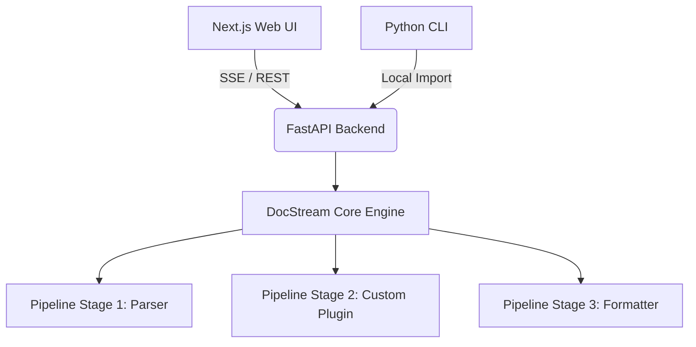

# 📄 DocStream

> High-performance, real-time document processing pipeline with a modular plugin architecture.

[](https://github.com/YashKasare21/docstream-new/actions/workflows/ci.yml)
[](https://opensource.org/licenses/MIT)
[](https://www.python.org/)
[](https://nextjs.org/)
[](CONTRIBUTING.md)

---

## 🚀 Demo

*(Upload a 15-second GIF of uploading a PDF and watching the LaTeX stream in real-time.)*

---

## ✨ Features

- **Real-Time Streaming:** Watch documents process chunk-by-chunk via Server-Sent Events (SSE).
- **Dual Interface:** Powerful CLI for automation + Intuitive Web UI for end-users.
- **Plugin Architecture:** Extensible pipeline system. Write a Python class and inject it into the processing stream.
- **Hybrid Monorepo:** Python core engine + Next.js frontend, containerized with Docker.

---

## 🏗️ Architecture



---

## 🐳 Quick Start (Docker)

The fastest way to get DocStream running:

```bash
git clone https://github.com/YashKasare21/docstream-new.git
cd docstream-new
make docker-up
```

Access the **Web UI** at [http://localhost:3000](http://localhost:3000) and the **API docs** at [http://localhost:8000/docs](http://localhost:8000/docs).

---

## 🛠️ Local Development

| Command | Description |
|---|---|
| `make install` | Install Python dependencies + npm modules |
| `make dev` | Run API + Web concurrently |
| `make test-python` | Run all Python tests |
| `make lint-python` | Lint Python sources with Ruff |
| `make docker-up` | Spin up full stack via Docker Compose |
| `make docker-down` | Tear down Docker services |

---

## 🧩 Creating a Plugin

DocStream uses a simple pipeline architecture. You can add custom processing stages (e.g., AI Summarization, PII Redaction) by implementing the `PipelineStage` interface:

```python
from docstream.pipeline import PipelineStage

class MyCustomStage(PipelineStage):
    @property
    def name(self) -> str:
        return "my_custom_stage"

    async def process(self, data: dict) -> dict:
        text = data.get("text", "")
        # Do something with the text
        data["text"] = text.upper()
        return data
```

---

## 🤝 Contributing

We love contributions! Please see the [CONTRIBUTING.md](CONTRIBUTING.md) for guidelines.

---

## 📜 License

Distributed under the MIT License. See [LICENSE](LICENSE) for more information.
