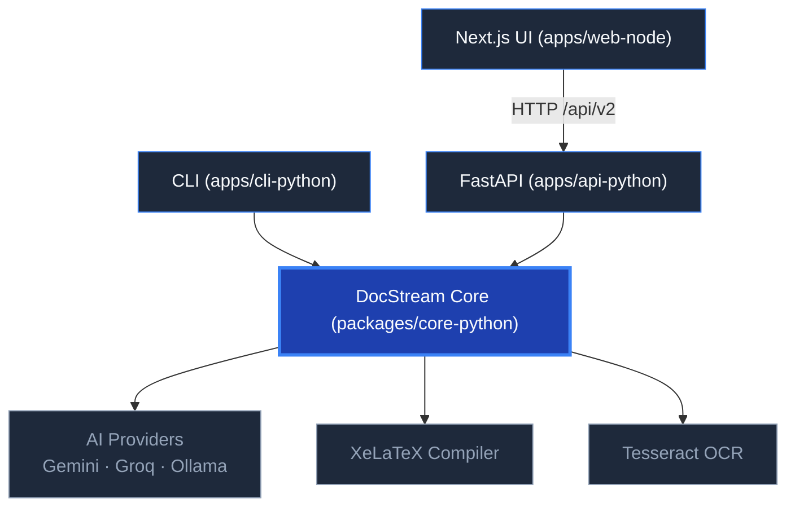

# DocStream

> AI-powered document conversion (PDF → LaTeX → PDF) — open source, FOSS-only stack.

[](https://github.com/YashKasare21/docstream-new/actions/workflows/ci.yml)
[](LICENSE)
[](https://www.python.org/)
[](https://nextjs.org/)
[](https://github.com/astral-sh/ruff)
[](CONTRIBUTING.md)

> ⚠️ **Active development.** APIs, paths, and packaging are still evolving — pin a commit if you depend on this.

---

## Features

- **Multi-format input** — PDF, DOCX, PPTX, images (PNG/JPG), Markdown, plain text
- **AI-powered LaTeX generation** — fallback chain of AI providers (Gemini → Groq → Ollama)
- **Professional templates** — Report, IEEE, Resume, and more
- **XeLaTeX compilation** — produces publication-quality PDF output
- **REST API** — FastAPI backend for HTTP access
- **Web UI** — Next.js 16 frontend with drag-and-drop upload
- **CLI tool** — terminal-first workflow for scripts and automation

---

## Architecture



---

## Quick Start

### Prerequisites

- Python **3.11+**
- Node.js **20+**
- XeLaTeX: `sudo apt install texlive-xetex texlive-latex-extra texlive-fonts-recommended`
- An API key for at least one AI provider (Gemini recommended — [free tier](https://aistudio.google.com/))

### Install & Run

```bash
git clone https://github.com/YashKasare21/docstream-new.git
cd docstream-new
make install
```

```bash
# Start API + Web (concurrent):
make dev
```

| Command            | What it does                                |
| ------------------ | ------------------------------------------- |
| `make install`     | Set up Python venvs + npm modules           |
| `make dev`         | Run API (8000) + Web (3000)                 |
| `make dev-api`     | Run FastAPI backend only                    |
| `make dev-web`     | Run Next.js frontend only                   |
| `make test`        | Run all Python tests                        |
| `make test-python` | Run core + API tests                        |
| `make lint`        | Ruff (Python) + ESLint (Web)                |
| `make format`      | Auto-format Python with Ruff                |

### Use the CLI

```bash
source apps/cli-python/.venv/bin/activate
docstream convert paper.pdf --template ieee --output ./out
docstream templates list
```

---

## Project Structure

```
docstream-new/
├── packages/
│   └── core-python/          # Shared library — the conversion engine
│       ├── pyproject.toml    # name = "docstream-core"
│       ├── docstream/        # Importable as `import docstream`
│       └── tests/
├── apps/
│   ├── cli-python/           # Terminal CLI
│   │   ├── pyproject.toml    # depends on docstream-core (local path)
│   │   └── docstream_cli/
│   ├── api-python/           # FastAPI backend
│   │   ├── pyproject.toml    # depends on docstream-core (local path)
│   │   └── docstream_api/
│   └── web-node/             # Next.js 16 frontend
│       ├── package.json
│       └── src/
├── docker/                   # Dockerfiles
├── docs/                     # Documentation
├── Makefile                  # Project orchestrator
├── LICENSE                   # MIT
└── README.md
```

---

## Configuration

Create a `.env` file at the repo root:

```env
GEMINI_API_KEY=your_gemini_key
GROQ_API_KEY=your_groq_key              # optional fallback
OLLAMA_BASE_URL=http://localhost:11434   # optional local fallback
ALLOWED_ORIGINS=http://localhost:3000     # CORS for API
```

All providers are optional — DocStream falls back automatically through the chain.

---

## Contributing

We welcome all contributions! See [`CONTRIBUTING.md`](CONTRIBUTING.md) for:

- Local development setup
- How to run tests
- Code style guidelines (Ruff + Prettier)
- Pull request workflow

**FOSS-only** — please don't add proprietary or paid services to the stack.

---

## License

[MIT](LICENSE) — © 2024–2026 Yash Kasare and contributors.
